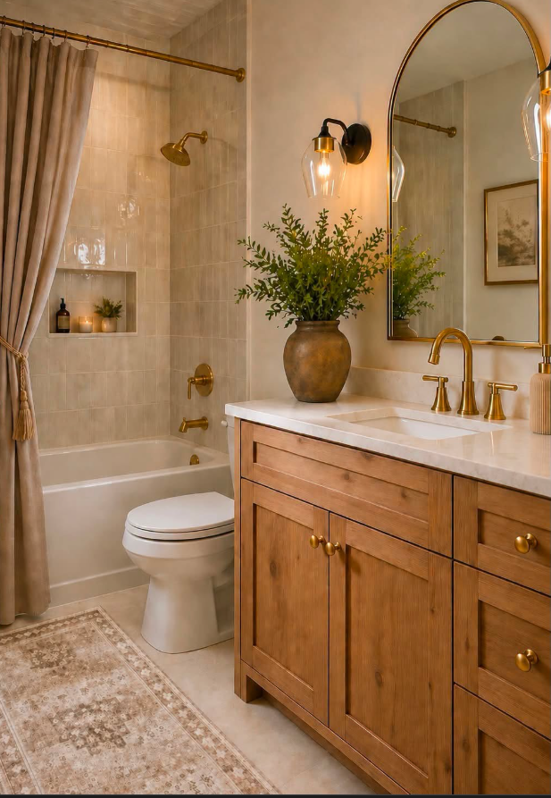
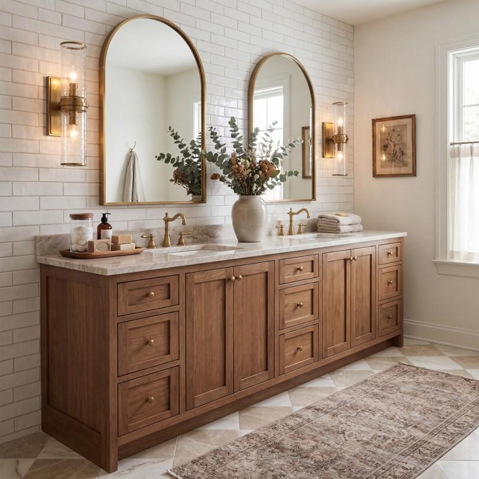

# Bathrooms

### Needs

- Water on/off valves accessible for all sinks and toilets

## Master Bathroom

### Wants

1. Built in tub, not too tall. Shower can be next to the tub. Windows by tub.

## Inspiration

Love gold everything and wood stain cabinets.

---

Source: https://app.notion.com/p/3c998a310343800ab262d9abd26e268d
