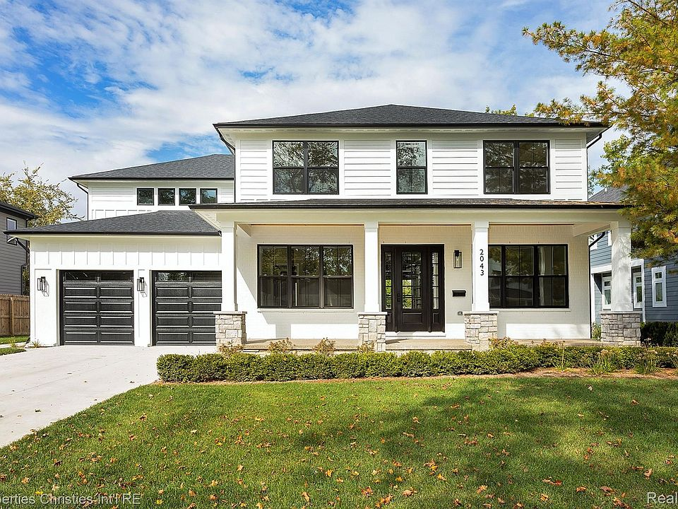
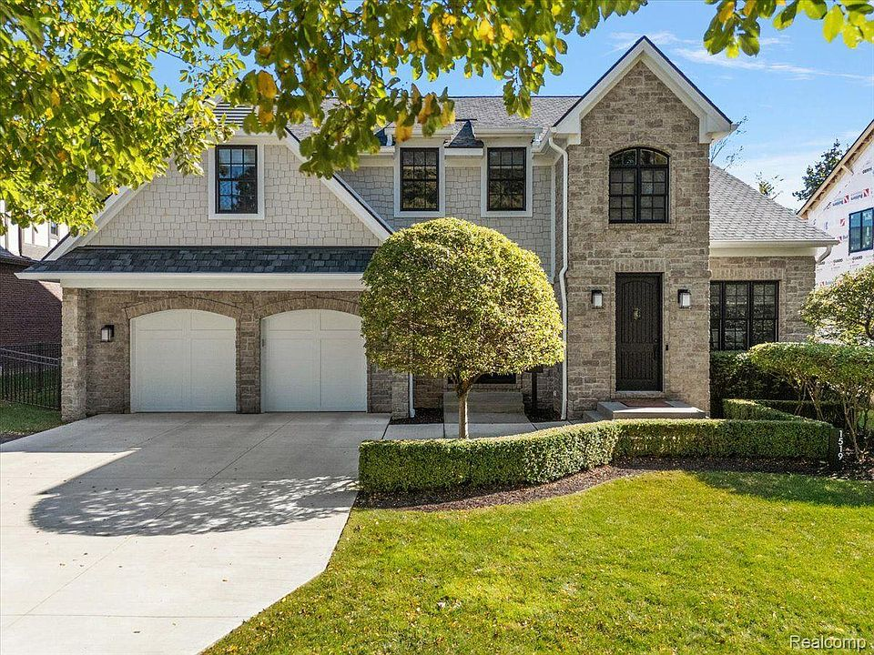
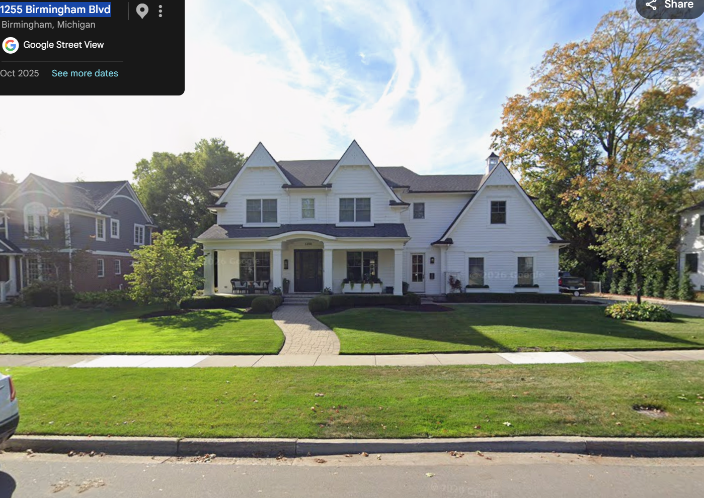
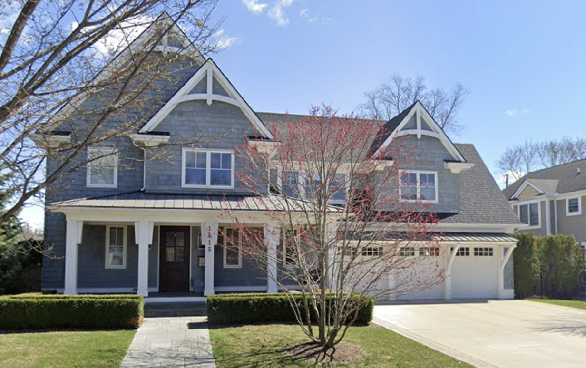
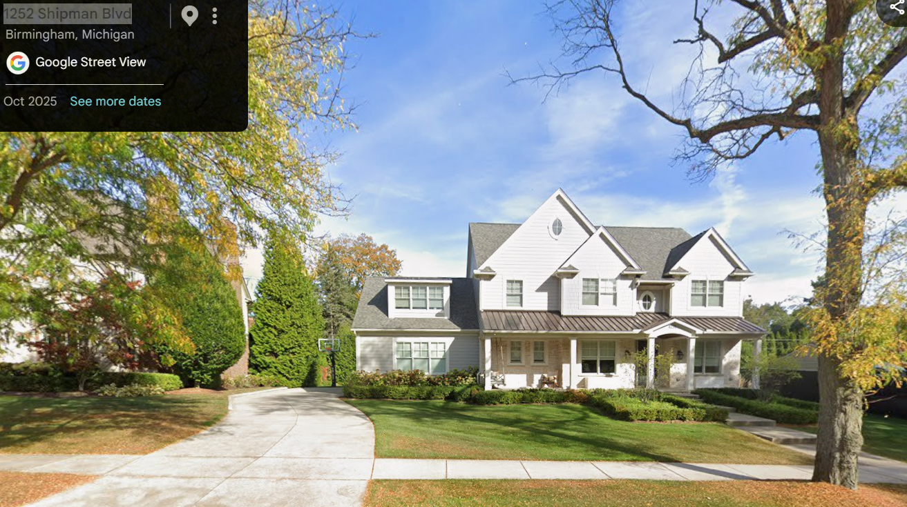
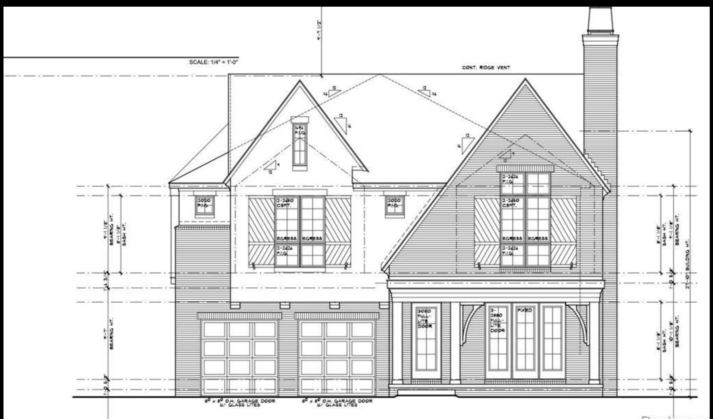
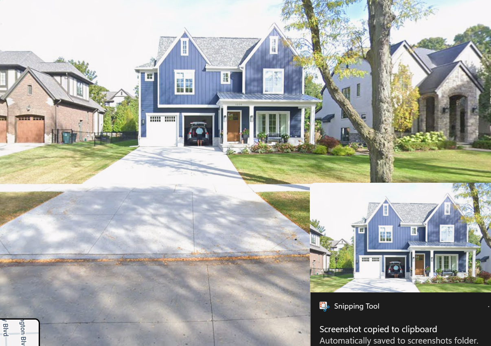
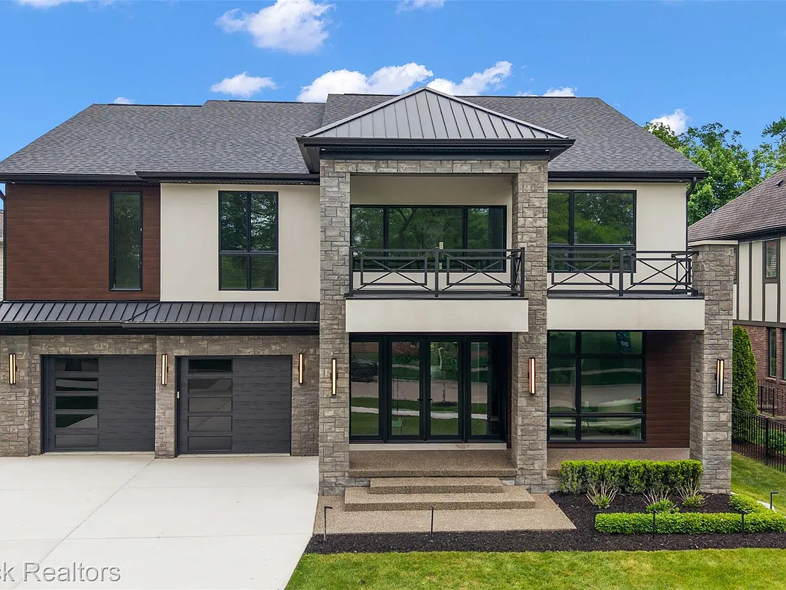
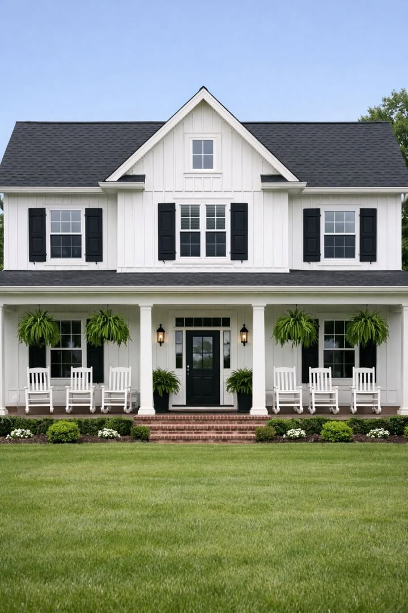
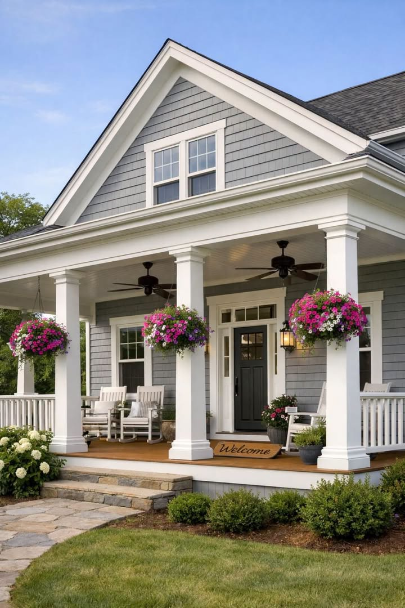

# Elevations

1. [2043 Yorkshire Rd, Birmingham, MI 48009 | Zillow](https://www.zillow.com/homedetails/2043-Yorkshire-Rd-Birmingham-MI-48009/24532286_zpid/), 75 x 140

1. [1519 Shipman Blvd | Logan Wert Real Estate Group](https://logansells.com/properties/1519-shipman-blvd), 75 x 13

1. This home is also a 75 by 130 and interestingly enough, it has side entry garage. 3 car garage.

1. Corner of Pierce and Catalpa:

1. Another one on Shipman that is also 75 by 130 on Shipman that has side entry garage. This is another 75 by 130 on shipman. Love that its front entry garage is really spacious.

1. Another one on Shipman that is also 75 by 130 with front entry

1. Another one on shipman with 75 by 130 with wide entrance, wide steps, and covered porch.

1. White painted front looks great

---

Source: https://app.notion.com/p/3c298a31034380dd9d41d99aa3f556f1
