# Floor plan design

AutoCAD printout:

[3cc98a3103438067ae90cc517f2ff3c3.pdf](assets/3cc98a3103438067ae90cc517f2ff3c3.pdf)

This lower level is just an idea showing multiple offices, stair landings, wide garage, mud, pantry, and full bathroom. Ideally the mudroom would be prepped for laundry even if we don’t use it for laundry initially.

## 8/30/2026 main floor version with dimensions:

- Larger second office / kid’s playroom

- Bathroom moved next to front door so it can have a window

- Dashed dark blue line is my guess as buildable envelope, based on Birmingham zoning and lot coverage

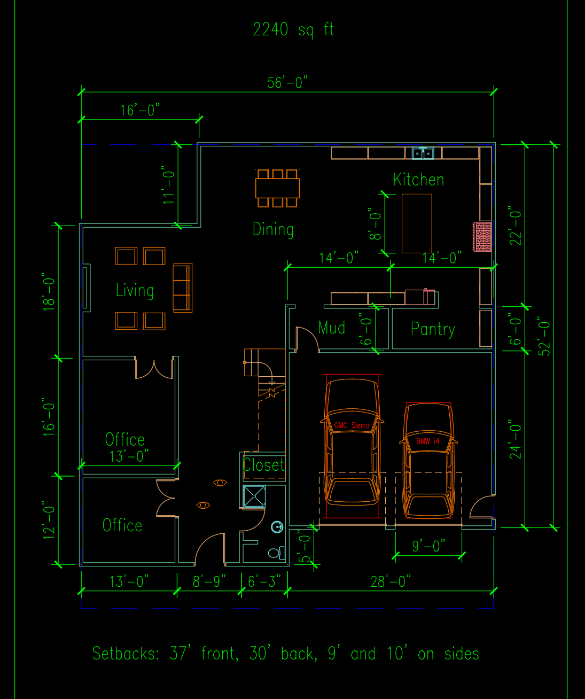

## 8/30/2026 second floor version with dimensions:

- Shared bathroom, one princess suite

- The upper left corner is over the back porch, so that may not work, or it’ll be the roof

- The master bath may need to be mirrored to have windows above the tub and toilet

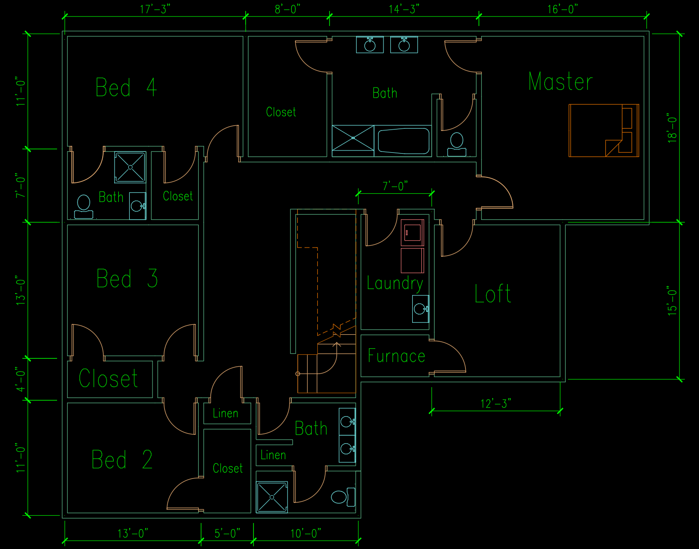

### 9/8 Alternate first floor

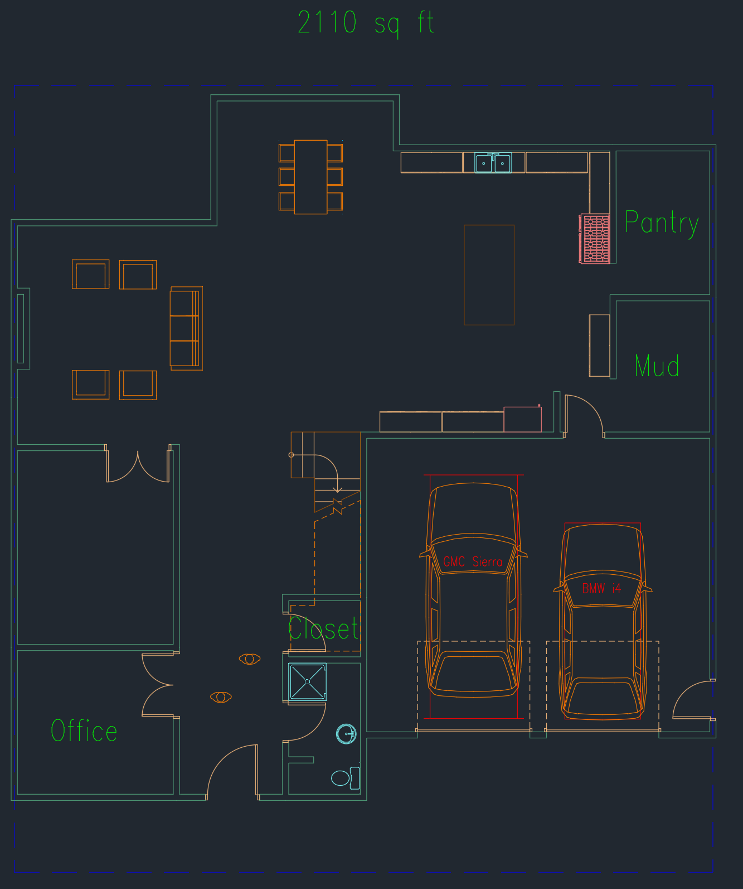

## 9/15 long garage concept

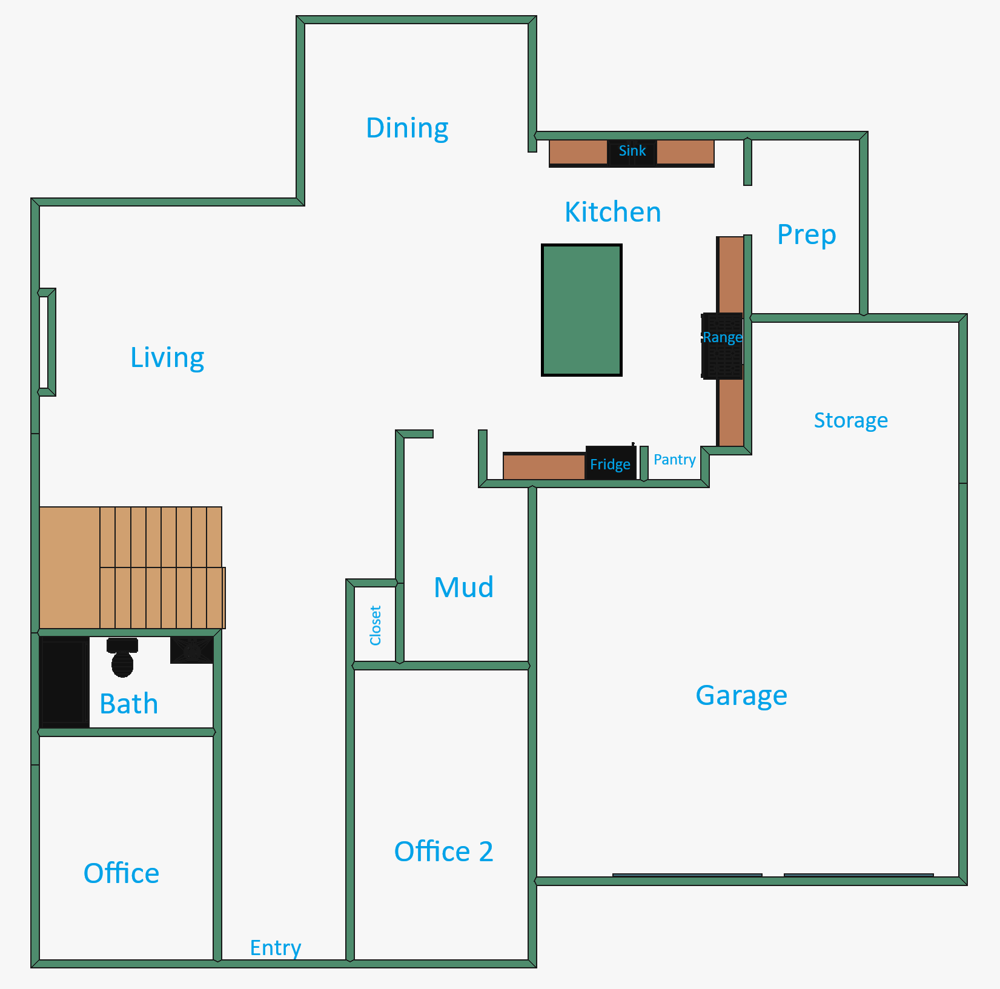

### 9/19 concept

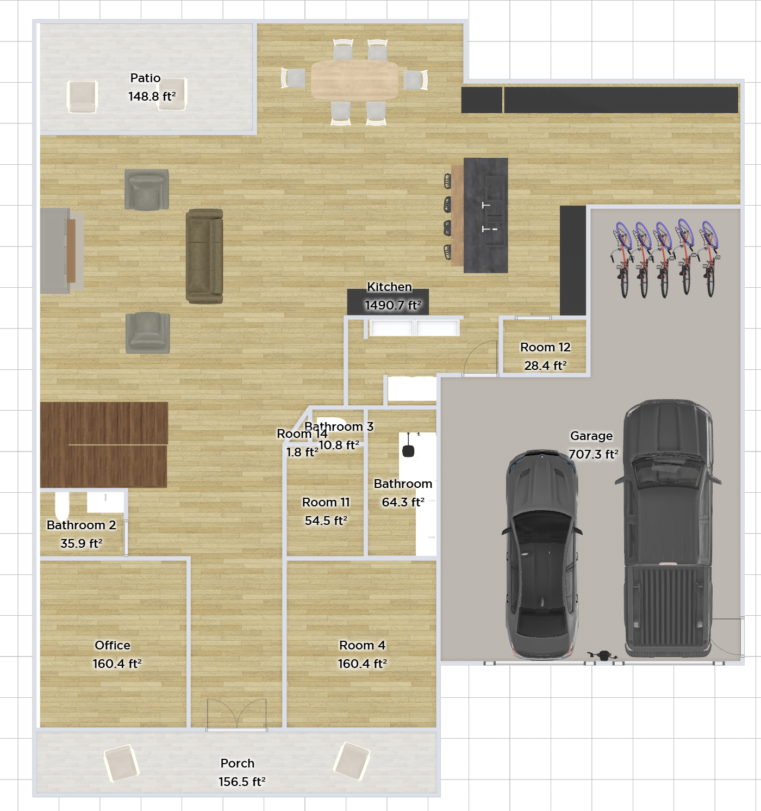

## First Floor Concept

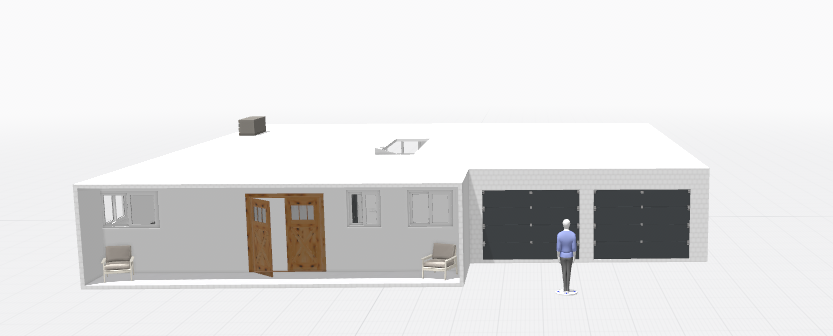

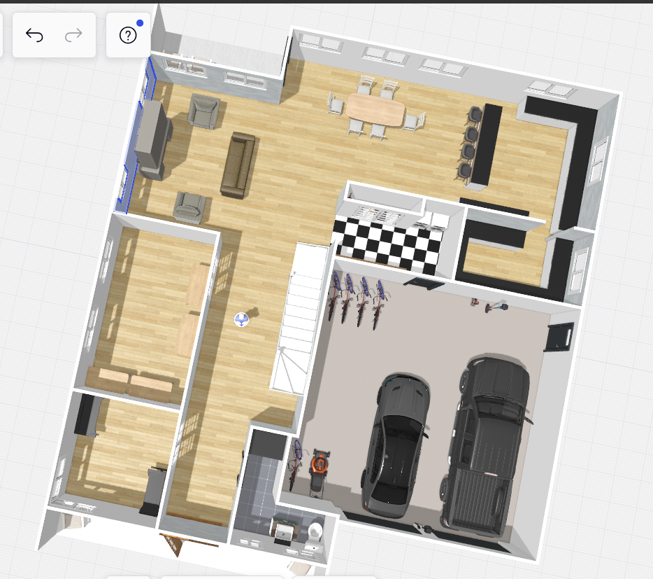

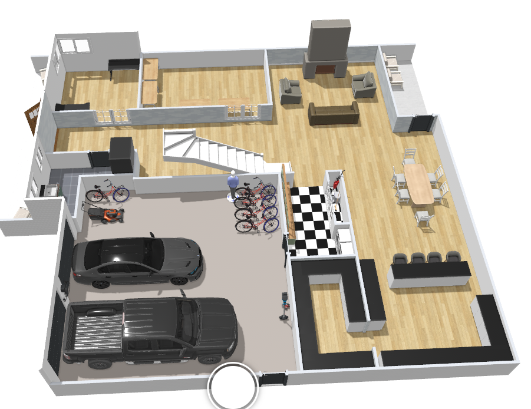

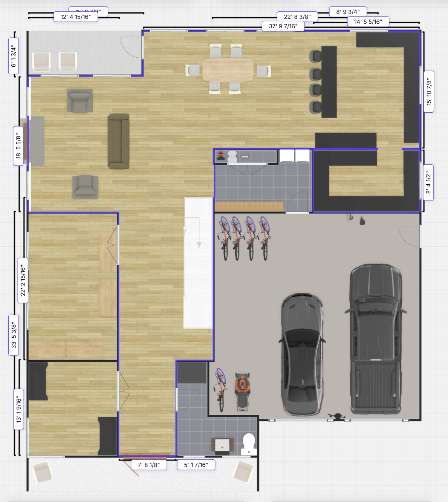

## Older

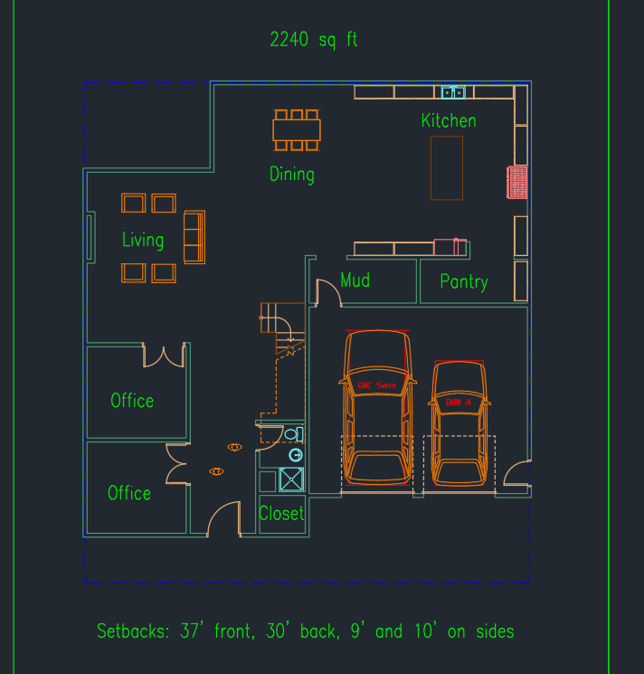

This upper level is not perfect, just showing four bedrooms and bathrooms plus loft. If space is an issue, there can be a jack and jill shared bathroom. The master probably shouldn’t share a wall with the other bedroom, but rooms can be shifted around.

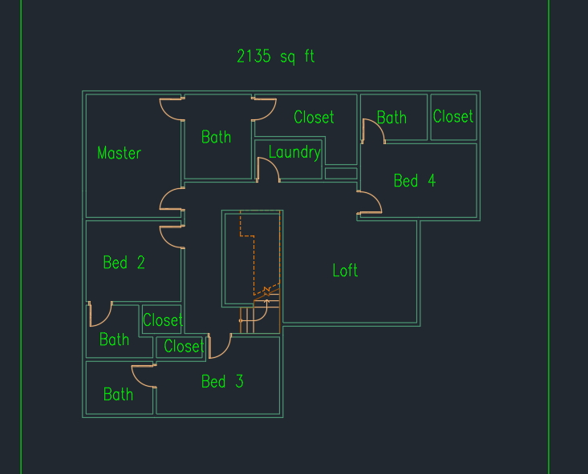

---

Source: https://app.notion.com/p/3c298a31034380f59a76f58d35296570
