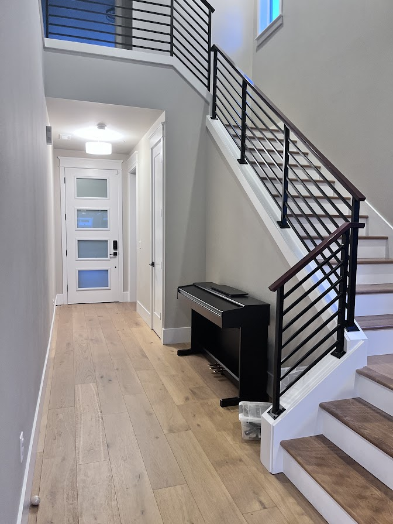
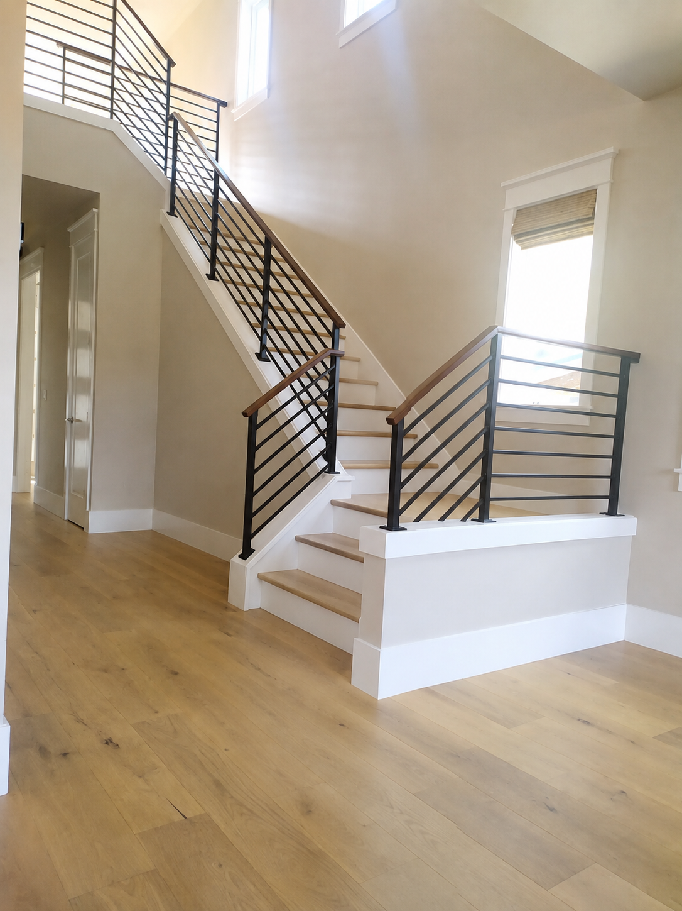
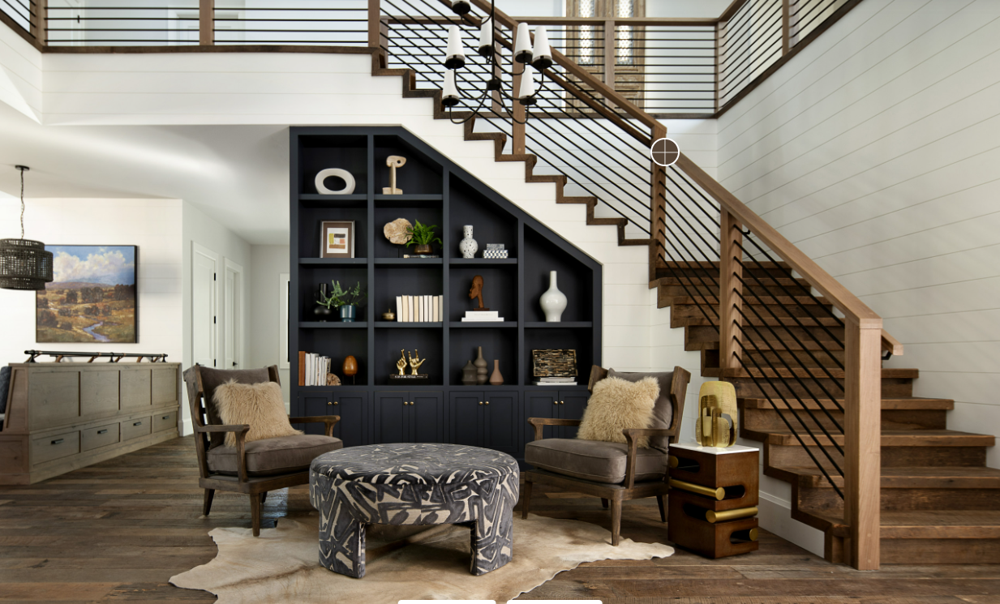
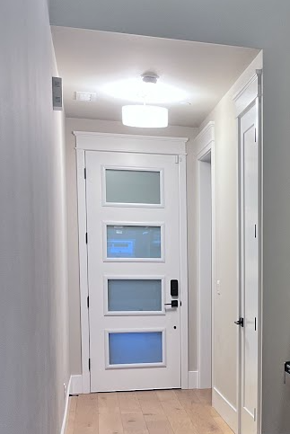
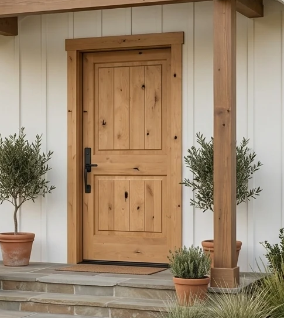

# Foyer

A bright, functional entry with stairs featuring black railings and clearly defined landing space(s), with hardwood flooring on the stairs and a tall front door.

### Needs

1. Top landing on the stairs for safety.

1. Hardwood on stairs.

1. Front door should feel tall and bright. 96” door

1. Front door is easy to maintain and easy to clean. See picture below for samples.

1. 8” trim throughout.

1. 96” tall door.

### Wants

1. Bottom landing.

1. Horizontal black stair railings style shown in reference photos.

1. Coat closet for guests.

1. Night lighting based on motion.

1. Door deadbolt and handle must be separate. We want no key on the handle, and the deadbolt will have fingerprint/passcode entry only. No keys for this house. Usually we’ve used Wyze bluetooth locks. This applies to all exterior doors.

### Pictures

This was our old front door, but the trim around the glass panels always gets dusty/dirty. So we’re not looking for glass panels again:

Front door color sample:

[Living Room](foyer/living-room.md)

---

Source: https://app.notion.com/p/3c698a3103438030b0fecd0763c87a13
