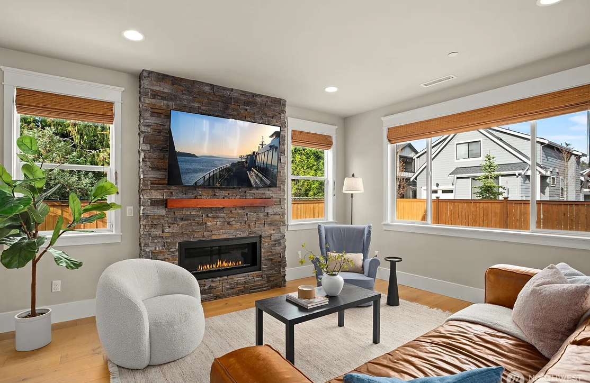
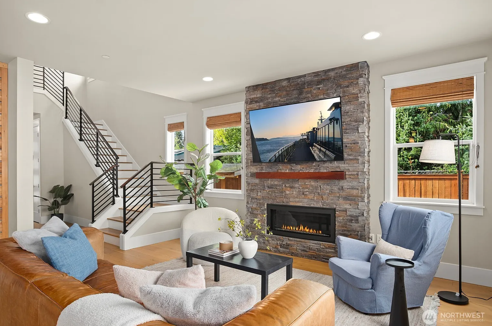
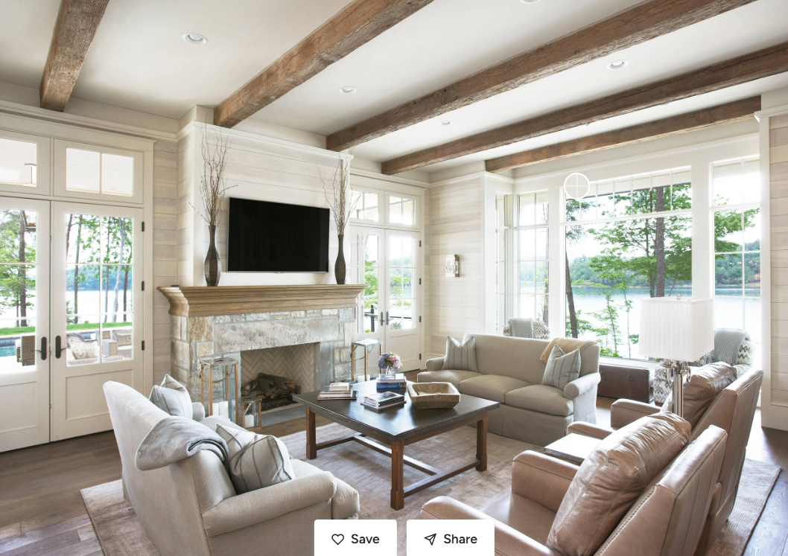

# Living Room

We’re aiming for a bright, modern focal wall with a wide horizontal gas fireplace flanked by two windows, with a stone look around the fireplace.

### Needs

1. Wider gas fireplace.

1. Two windows next to the fireplace to maximize natural light.

1. Stone look for the fireplace surround.

1. Extra blocking behind TV over fireplace for hanging bracket.

1. Ethernet port at the TV/fireplace location, run down to the entertainment cabinet location.

1. At least 3 HDMI runs (or conduit sized for future HDMI) from the TV/fireplace location down to the entertainment cabinet location (one each for Xbox, Switch, and security cameras).

1. Engineered hardwood throughout. At least 7” plank width.

### Wants

1. Similar overall look/feel to the reference photo.

1. Floor outlet near primary seating area.

### Pictures

Below two pics are our previous living room in Seattle.

Inspiration photo.

---

Source: https://app.notion.com/p/3c598a3103438075a773f62492d27fee
