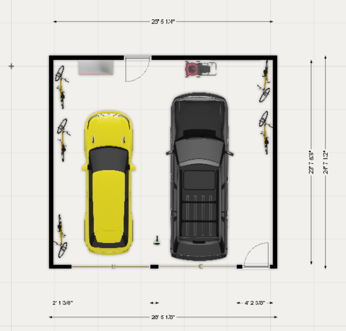
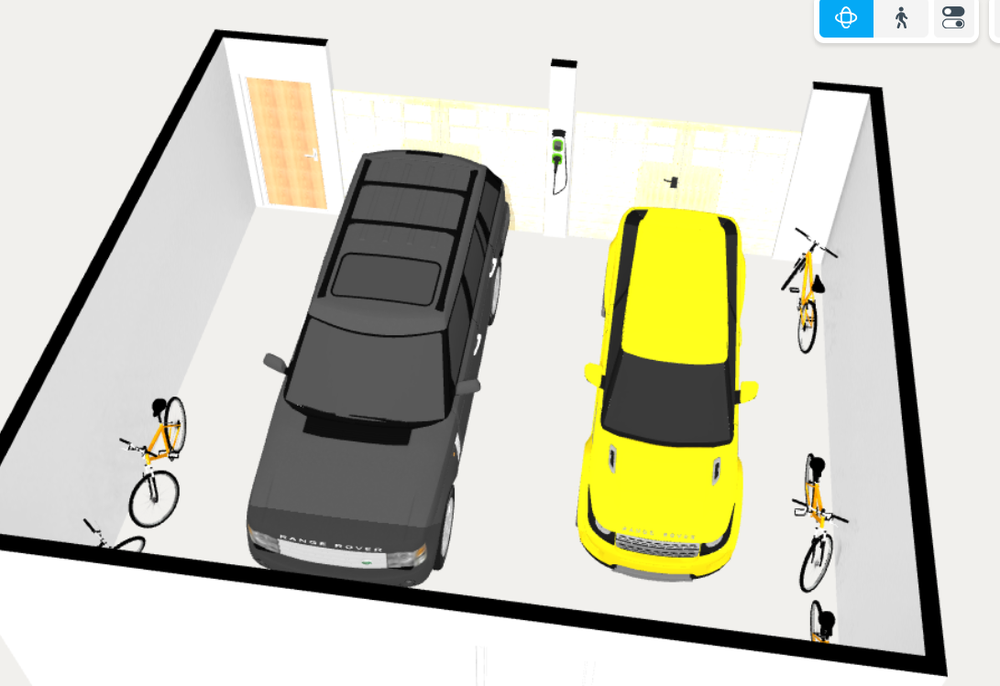
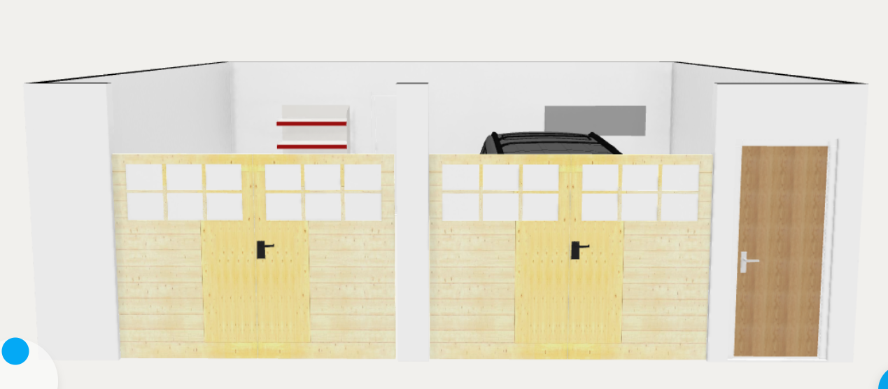

# Garage

## Needs

1. Large two car garage

1. Space for truck GMC Sierra and sedan. Maximize allowed door sizes for Birmingham, which is two 9’ doors.

1. Space in front and side of the vehicles for tools, bikes, lawn mower

1. High voltage plugs for car chargers 

1. Drive straight into the garage, no driveway twists

## Wants

1. Two high voltage plugs for car chargers, one on each side

1. Painted walls and ceiling

1. Epoxy coated garage floor

## Garage Concept

- Both cars are exact dimensions of a large truck and a mid-size sedan.

---

Source: https://app.notion.com/p/3c698a31034380e9a0efdad28a5eb9e4
