# Kitchen

Bright and highly functional family kitchen with great storage, durable finishes, and strong lighting. Family loves to cook, and we typically have about 3 people in the kitchen at the same time, so it needs to feel comfortable for multiple people working together.

### Needs

1. Kitchen sink facing the windows.

1. Prep kitchen (countertop and sink) + pantry combined.

1. Plenty of outlets for small appliances.

1. Canned lights with diffusing cover.

1. Undercabinet lighting.

1. Durable, easy-to-clean surfaces and finishes.

1. Lots of deep drawers instead of lower cabinets with doors.

1. Pull-out cabinet for trash + recycling.

1. Vertical tray storage for cutting boards and baking sheets.

1. Soft-close doors and drawers.

1. Cabinets to the ceiling.

1. Engineered wood flooring to match the rest of the main level.

1. Deep sink to prevent splashing

1. Under-sink storage solution for sponges, cleaning supplies, etc.

1. Island fits 4 people comfortably. 

1. Two pre-drilled accessory holes for built-in hand soap dispenser and built-in dish soap dispenser

1. Deep pull-out drawer for plastic containers.

1. Deep pull-out drawers for plates and bowls.

1. 48” induction range. Might be from Kitchen Aid.

1. Column fridge and freezer. Might be from Fisher & Paykel. 

1. Microwave and/or air fryer.

1. Cold drinkable/filtered water dispenser since some column fridge may not have them.

1. Will need a large electrical panel capacity to accommodate appliances running.

1. Second sink somewhere (like prep kitchen)

1. Water leak sensor.

### Wants

1. Windows in the prep kitchen

1. Paper towel holder inside a cabinet

1. Might have to prep range for gas in case of resale.

1. Prefer warm wood style kitchen

1. Drawer with power outlets for phones, tablets, laptops.

1. Instant drinkable hot water dispenser.

1. Oversized dishwasher.

1. Storage on both sides of the island.

### Pictures

Kitchen sink facing the windows — reference example.

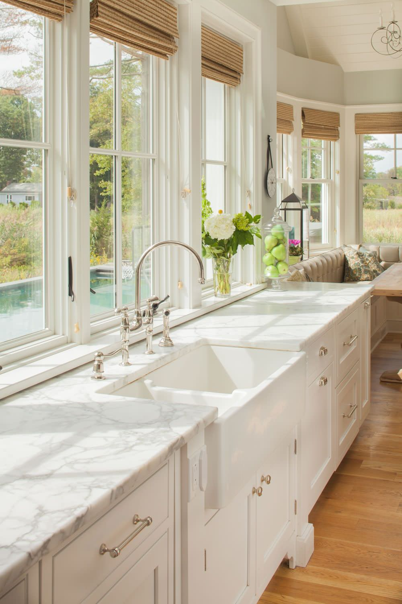

Pull-out trash + recycling cabinet — reference example.

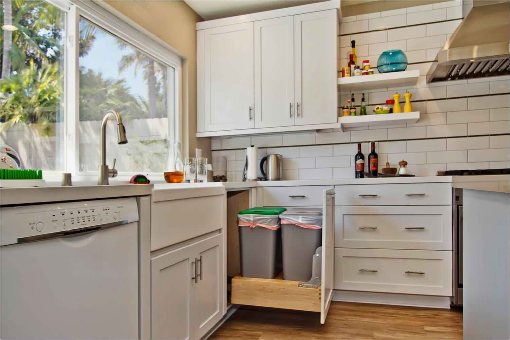

Under-sink pull-out storage for cleaning supplies — reference example.

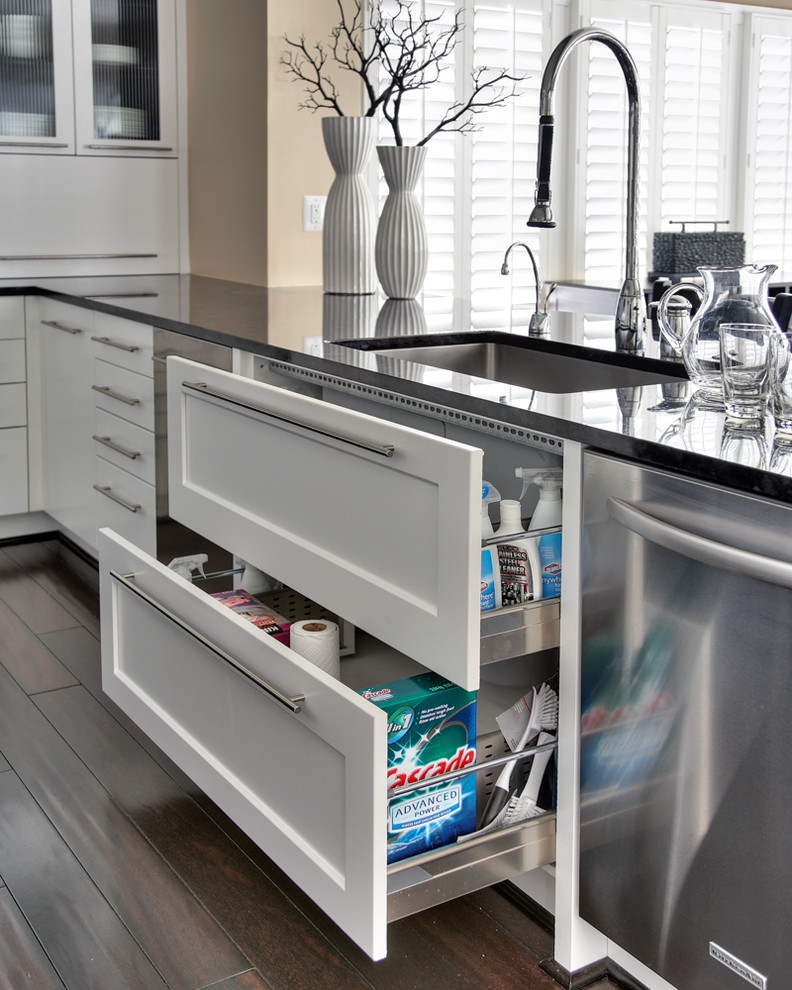

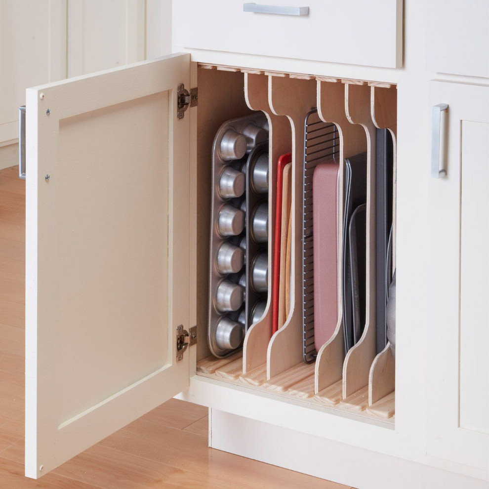

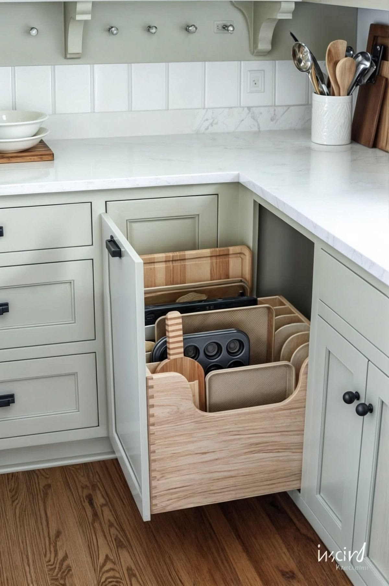

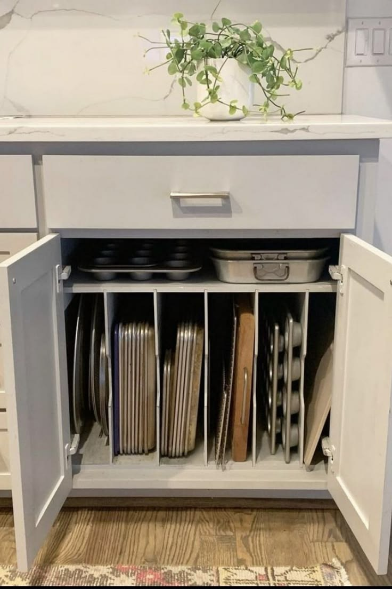

Warm wood kitchen cabinets wood stain. Light stain.

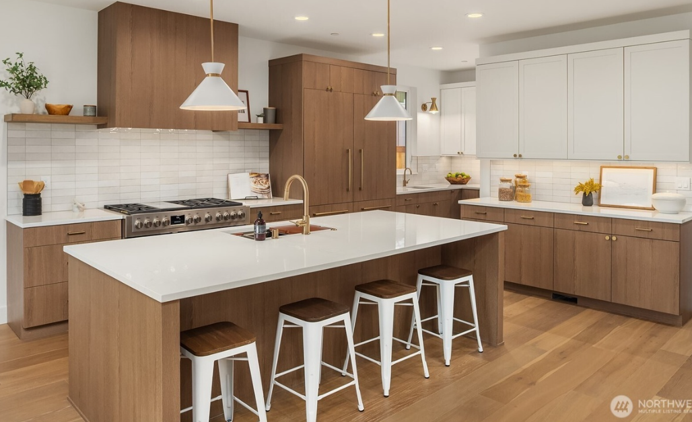

Love the island, lighter tone of wood.

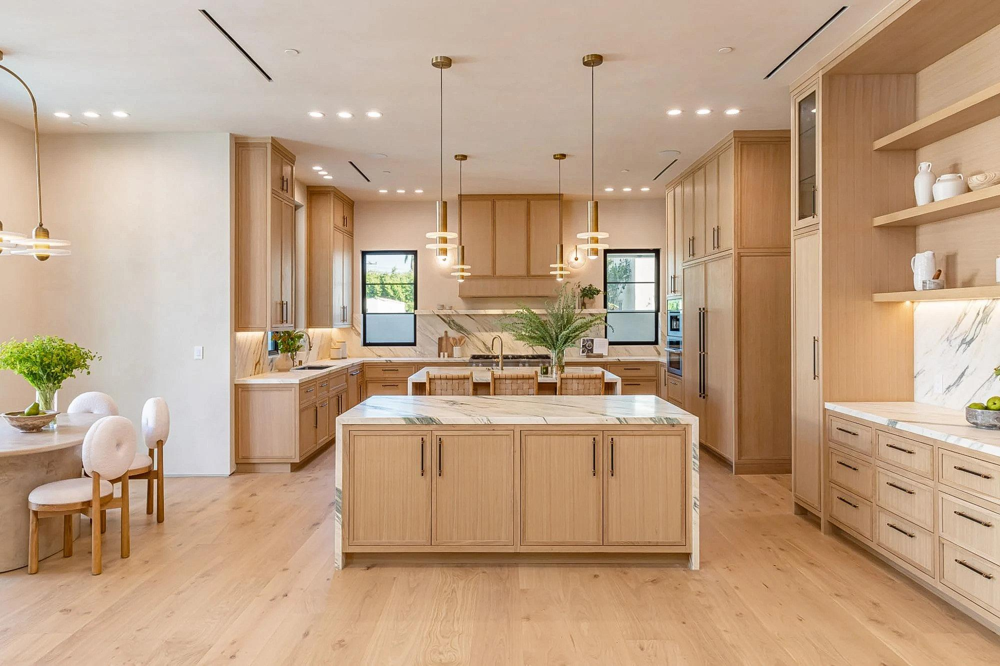

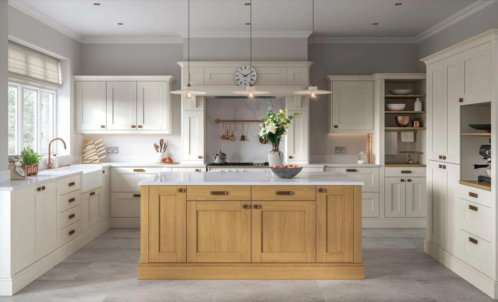

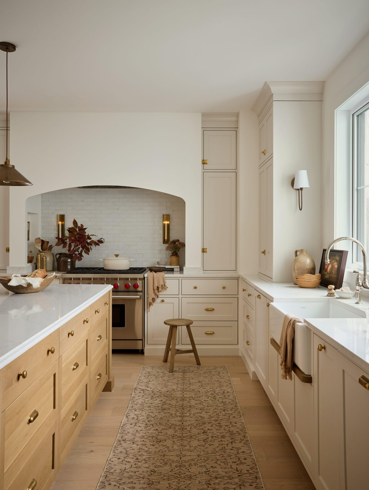

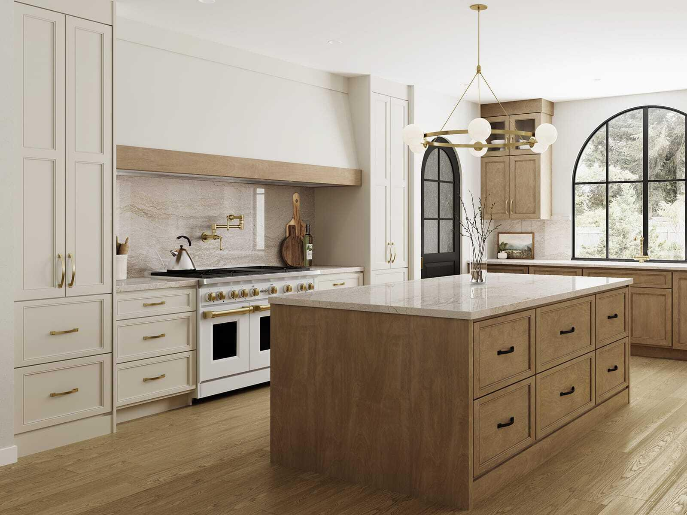

---

Source: https://app.notion.com/p/460473c0b17447d2bfdd01bbb98966bf
