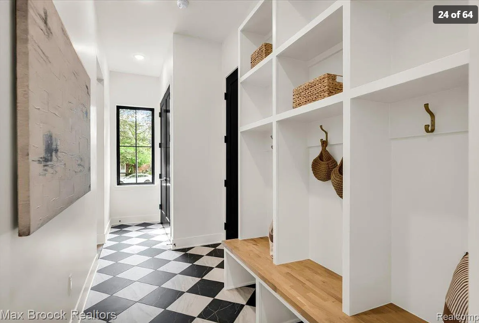

# Mud Room

We’re aiming for a durable, highly functional family entry from the garage with organized storage for children and adults. The space should provide designated storage for coats, shoes, backpacks, sports equipment, cleaning supplies, and winter gear. It should also be prepared for a future stacked washer and dryer without requiring major remodeling. With outlets to charge vacuum cleaners.

### Needs

1. Open or ventilated shoe storage beneath the bench.

1. Closet to store additional coats.

1. Space to charge vacuum cleaners.

1. Durable, waterproof, and easy-to-clean flooring.

1. Durable, washable wall finish behind the bench and hooks.

1. Drop zone for keys, mail, bags, and sunglasses.

1. Space for backpacks without blocking the walkway.

1. Reserved space sized for a future full-size stacked washer and dryer.

### Wants

1. Drawers for hats, gloves, scarves, sunscreen, and other small accessories.

1. Storage for extra shoes somewher. 

1. Motion-sensor lighting.

### Pictures

Something like this, but will need a total of 6 cubbies. Each cubie has 2 hooks.

---

Source: https://app.notion.com/p/3c698a3103438065838ad14ad3afd761
