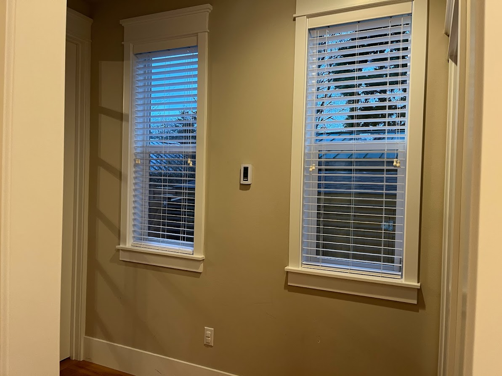
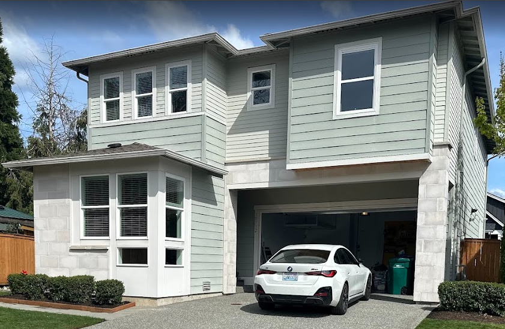

# Windows

Good quality windows that are easy to maintain, clean. Stay standard size as much as possible. Something easy to get window treatments.

Current choice: Andersen 100 casement windows everywhere, no custom size. White interior casement windows. Exterior could be white or black.

## Needs

- Many windows for a bright house with natural sunlight

- Avoid custom size windows

- Windows with windows sill

- Windows with trim around them, inside and outside

- Wired for automated shades.

- Frosted windows in bathroom or walk in closet if they have windows.

- Kids rooms do not have low windows

## Pictures

Here’s the inside of our previous house’s windows, with trim around them.

Here’s the outside of our previous house’s windows, with trim around the upper level windows.

---

Source: https://app.notion.com/p/3c698a31034380ea8c15d987418bfb32
